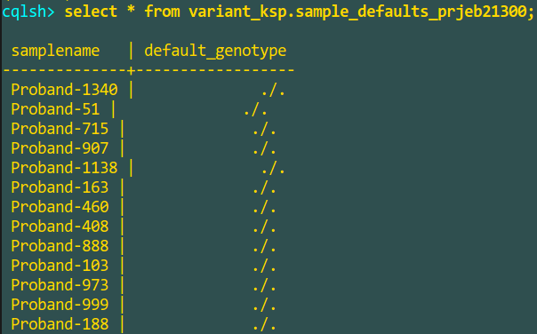
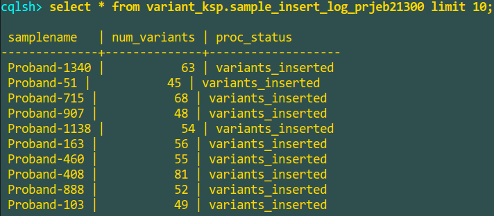

# Overview

This project aims to address the difficulties in ingesting per-sample VCF files, provided for certain studies, into the [EVA-pipeline](https://github.com/EBIvariation/eva-pipeline/). 

As it currently stands, EVA-pipeline can only ingest "full" VCF files wherein information for all the samples is provided in a single VCF file. However, a single VCF file cannot be trivially generated for certain studies with a large number of samples, for ex: the [3000 Rice Genomes project](http://www.ebi.ac.uk/eva/?eva-study=PRJEB13618). In such cases, a solution, that can ingest these "single-sample" VCF files in parallel, is needed.

For a detailed discussion, see Proposal#2 in this [page](https://www.ebi.ac.uk/seqdb/confluence/display/VAR/Merging+Single-Sample+files).
      
# Project files

**SingleSampleMerge.py** - First pass

Apache Spark job that:
 1. processes the individual study files in parallel 
 2. filters out monomorphic references 
 3. inserts the variants into Apache Cassandra
 4. determines the unique set of variant positions + their post-normalization positions
 5. scans the individual samples for the variant positions obtained from the first pass (i.e., after SingleSampleMerge.py has run).
 6. inserts the _**non-default**_ genotypes encountered in each sample into Cassandra (based on how many positions match in the individual sample files, a default genotype is assumed for the entire sample in order to minimize the number of inserts made into Cassandra. For example: 0/0 for >50% match, ./. otherwise).

**spark_cluster_creation** - Ansible playbook to create a Spark cluster.  

# Steps to run the project

1. Create an Apache Spark Cluster as follows:
   1. Determine the master node. This is where you will download the project files and install Ansible. 
   2. Install Ansible on the master node with the instructions [here](http://docs.ansible.com/ansible/latest/intro_installation.html).
   3. Edit the **spark-hosts** file in the "spark_cluster_creation" folder with the IP addresses of the master node and the slave nodes.
   4. Run the Ansible playbook to deploy a Spark Cluster: ```ansible-playbook -i spark-hosts spark-install.yml```.

2. Create an Apache Cassandra cluster as described [here](https://github.com/EBIvariation/eva-variant-warehouse-research/blob/master/Cassandra_Evaluation/ansible_playbook/readme.md).
 
3. Download the study VCF files to a shared directory that can be accessed by all the Spark slave nodes.

4. Download the static binaries for bcftools from **/nfs/production3/eva/software** to a shared directory that can be accessed by all the Spark slave nodes.

5. Run SingleSampleMerge.py with arguments as follows:

   ```export SPARK_LOCAL_IP=<MASTER_NODE_IP> && ~/spark-2.2.0-bin-hadoop2.7/spark-submit --packages com.datastax.spark:spark-cassandra-connector_2.11:2.0.1 SingleSampleMerge.py <Study PRJ ID> <Default Genotype> <Missing Genotype> <Full Path to study files> <Cassandra node IP1> <Cassandra node IP2> <BCF Tools Directory>```
   
   Example:
   
   ```export SPARK_LOCAL_IP=192.168.0.14 && ~/spark-2.2.0-bin-hadoop2.7/bin/spark-submit --packages com.datastax.spark:spark-cassandra-connector_2.11:2.0.1 SingleSampleMerge.py PRJEB21300 0/0 ./. /mnt/glusterVol/mergevcfinput 192.168.0.18 192.168.0.23 /mnt/glusterVol/bcftools```
   
6. After the above step runs to completion, the following output tables are created in Cassandra in the "variant_ksp" keyspace:

    1. **variant_ksp.variants_\<Study PRJ ID\>** (ex: variant_ksp.variants_PRJEB21300) - Variant information processed from individual sample files ordered by Chromosome, Start position and Sample Name.
    
    2. **variant_ksp.headers_\<Study PRJ ID\>** (ex: variant_ksp.headers_PRJEB21300) - Header information for each sample file that was processed.
    
    3. **variant_ksp.sample_defaults_\<Study PRJ ID\>** (ex: variant_ksp.sample_defaults_PRJEB21300)
    
    4. **variant_ksp.sample_insert_log_\<Study PRJ ID\>** - Commit log that shows the running log of sample files that have been inserted (as denoted by the insert_flag).
    
    5. **variant_ksp.study_info_\<Study PRJ ID\>** (ex: variant_ksp.study_info_PRJEB21300) - Total and distinct counts of variants that were inserted from all the samples.
    
    6. **variant_ksp.uniq_pos_\<Study PRJ ID\>** (ex: variant_ksp.uniq_pos_PRJEB21300) - Unique set of variant positions (includes both post-normalization and pre-normalization) scanned from all the VCF files during the first pass.
    
    
8. The output tables above should be used to sequentially process the variant records for the study and create a single VCF file that can be consumed by the [EVA-pipeline](https://github.com/EBIvariation/eva-pipeline/).